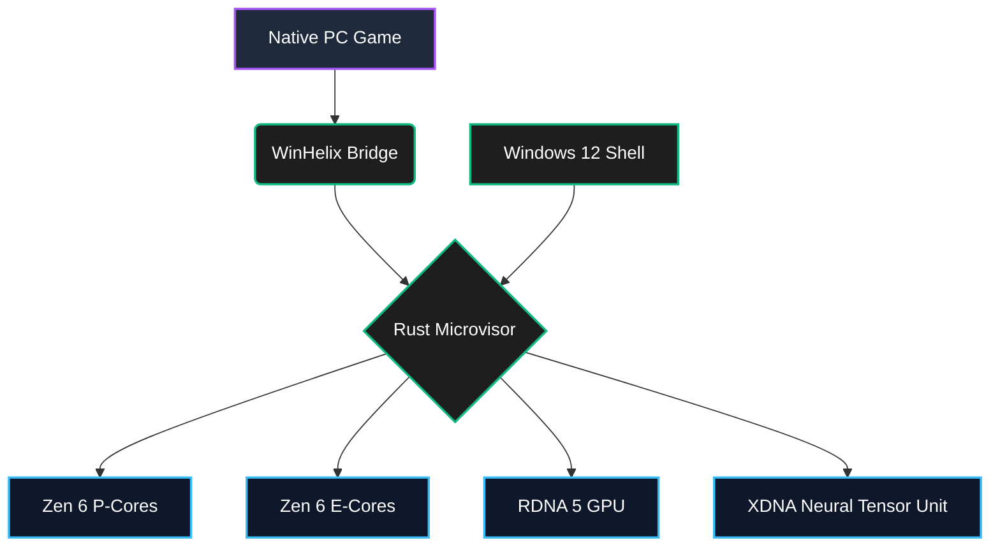

# Architectural Overview: AMD Zen 6 & RDNA 5 on Project Helix

Project Helix (Holiday 2027) represents a fundamental shift in console architecture. By unifying the PC and Console ecosystems, the underlying silicon must dynamically adapt to highly divergent workloads.

## The Asymmetric Zen 6 CPU
Unlike previous generations, Helix utilizes an asymmetric core design, pairing massive Performance Cores (P-Cores) with hyper-efficient Dense Cores (E-Cores).

* **Gaming Workloads (PC & Xbox Native):** Pinned exclusively to the P-Cores. The `Zen6Dispatcher` in our Rust Microvisor ensures that game draw calls never share L3 cache with the operating system.
* **Windows 12 Shell & Background Services:** Pinned to the E-Cores. The C# WinUI 3 dashboard runs silently in the background, consuming less than 2% of total system power while a game is active.



## RDNA 5 and the Dedicated XDNA NPU

Traditionally, AI upscaling (like DLSS or FSR 2) consumed valuable compute cycles on the GPU's main shader cores. RDNA 5 introduces a dedicated **XDNA Neural Tensor Unit**. The main GPU rasterizes the game at 1080p, and the NPU asynchronously upscales it to 4K/120fps using the ```DiamondGrameGen``` orchestrator without costing a single frame of standard GPU performance.
