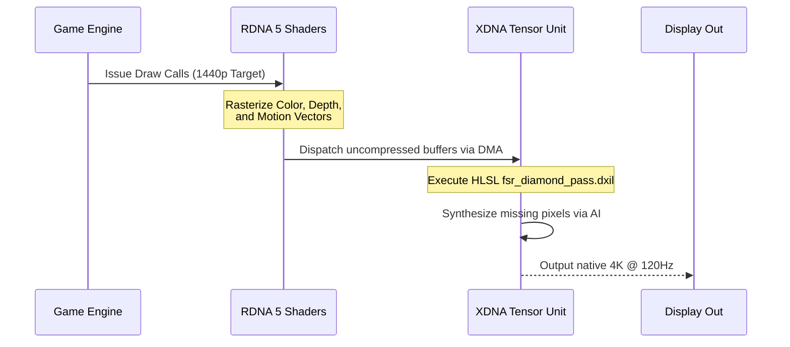

# FSR Diamond: Hardware-Accelerated Neural Rendering

**FSR Diamond** is the proprietary AI upscaling solution built into Project Helix. Unlike temporal upscalers that rely purely on math and history, Diamond utilizes a deep learning model trained on millions of high-resolution 16K images.

## The Tensor Pipeline

By pushing the fsr_diamond_pass.hlsl compute shader entirely to the NPU, we free up up to 30% of the GPU's standard compute units. These freed units are then dynamically reallocated to our MicroPolygonEngine and RayTracingCore, allowing PC games to look fundamentally better on Helix than on equivalently spec'd standard PCs.
